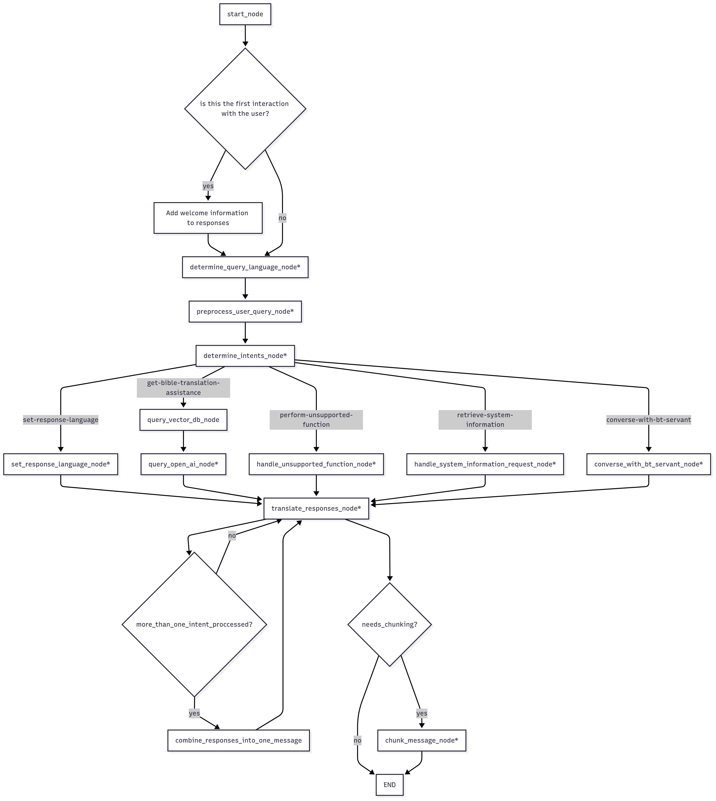

# 🤖 bt-servant-engine

An AI-powered WhatsApp assistant for Bible translators, now powered by **Meta's Cloud API** (no more Twilio!). The assistant uses FastAPI, OpenAI, and ChromaDB to answer Bible translation questions in multiple languages.

---
## 🧠 How the Decision Graph Works (brain.py)
The decision graph below defines the flow of a Bible translation assistant that uses a Retrieval-Augmented Generation (RAG) pipeline to respond to user messages intelligently and faithfully. Each node represents a distinct step in the processing pipeline, and transitions between them are determined either linearly or conditionally based on user input and system state.


**Nodes making LLM API calls*

## 🔄 Node Summaries
- **determine_query_language_node:** Detects the language of the user's message to support multilingual responses and select the appropriate document collection. 
- **preprocess_user_query_node:** Clarifies the user's message using past conversation context, correcting ambiguity and minor issues while preserving intent.
- **determine_intent_node:** Classifies the user's message into one or more predefined intents: 
- **set_response_language_node:** Updates the user's preferred response language in persistent storage.
- **query_db_node:** Searches relevant ChromaDB document collections using the transformed query, applying a relevance filter to determine if results are useful.
- **query_open_ai_node:** Uses OpenAI (with context from RAG results and chat history) to generate a response. Conditional logic routes long responses to chunking.
- **chunk_message_node:** If the assistant's response exceeds the 1500-character limit imposed by WhatsApp, this node semantically chunks the message into smaller parts.
- **translate_responses_node:** Translates the assistant's final output into the user’s preferred language, if needed.
- **handle_unsupported_function_node**, **handle_unclear_intent_node**, and **handle_unrelated_information_request_node:** Graceful fallback nodes triggered when the system can't determine the user's intent, the function is unsupported, the question is off-topic, or the user is asking about how the system works.
- **handle_system_information_request_node:** This node handles user questions about the assistant itself — such as what it can do, how it works, or what resources it uses. When this intent is detected, the system loads a predefined system prompt that frames the assistant as a helpful RAG-based servant to Bible translators. The assistant uses this context to generate a response strictly limited to the help docs.

## 🧠 How User Intent Is Determined
The assistant uses a dedicated node called determine_intent_node to classify the user’s message into one or more high-level intents, which are used to determine the next step in the assistant’s response pipeline. This node relies on the OpenAI model (gpt-4o) to parse the message in context. It sends the following structured input to the model:

- The current user message (already preprocessed and clarified). 
- The full chat history (if available), so the model can detect intent based on prior interactions.

The model receives a tightly constrained system prompt instructing it to always return at least one intent, using a fixed enumeration. The model’s response is parsed into a list of valid IntentType enum values.

## 🧭 Current Supported User Intents
- retrieve-information-from-the-bible 
- retrieve-information-about-the-bible 
- retrieve-information-about-the-process-of-translation 
- retrieve-non-translation-or-non-bible-information 
- translate-the-bible 
- execute-task-unrelated-to-the-bible-or-translation 
- retrieve-information-about-the-bt-servant-system 
- specify-response-language 
- unclear-intent

## 🔄 How Intents Drive the Decision Graph
The extracted intent(s) are used by the function process_intent(state) to conditionally branch to the appropriate node in the LangGraph. Here’s how different intents affect the flow:
- **specify-response-language** → Routes to set_response_language_node, which updates the user’s language preference and skips retrieval/generation. 
- **retrieve-information-about-the-bt-servant-system** → Routes to handle_system_information_request_node, which uses help docs and a special system prompt to answer. 
- **unclear-intent** → Routes to handle_unclear_intent_node, which politely asks the user to rephrase. 
- **execute-task-unrelated-to-the-bible-or-translation** → Routes to handle_unsupported_function_node, a graceful fallback that informs the user the function isn't supported. 
- **retrieve-non-translation-or-non-bible-information** → Routes to handle_unrelated_information_request_node, which tells the user that the assistant only supports Bible-related queries. 
- **All other intents (e.g., Bible questions, translation process queries, etc.)** → Route to query_db_node, which kicks off the full RAG pipeline.

This intent-based routing allows the assistant to intelligently short-circuit, fail gracefully, or fully engage the RAG pipeline depending on what the user needs — all with modular, explainable logic.

## 🚀 Environment Setup

This app uses a `.env` file for local development.

### ✅ Step-by-Step Setup (Local)

1. **Create a `.env` file**

```bash
cp env.example .env
```

2. **Edit your `.env`**

Fill in the required values:

```env
OPENAI_API_KEY=sk-...
META_VERIFY_TOKEN=your-verify-token-here
META_WHATSAPP_TOKEN=your-meta-access-token-here
META_PHONE_NUMBER_ID=your-meta-phone-number-id
BASE_URL=https://your.public.domain
GROQ_API_KEY=gsk_IJ...
```

> ℹ️ All five above variables are required for the Meta Cloud API to work properly.

3. **Install dependencies**

```bash
pip install -r requirements.txt
```

4. **Run the app**

```bash
uvicorn bt_servant:app --reload
```

---

## 🌐 Environment Variables Explained

| Variable               | Purpose                                                         |
|------------------------|-----------------------------------------------------------------|
| `OPENAI_API_KEY`       | Auth token for OpenAI's GPT models                              |
| `GROQ_API_KEY`       | Auth token for Groq models                                      |
| `META_VERIFY_TOKEN`    | Custom secret used for Meta webhook verification                |
| `META_WHATSAPP_TOKEN`  | Access token used to send messages via Meta API                 |
| `META_PHONE_NUMBER_ID` | Phone number ID tied to Meta app/WABA                           |
| `BASE_URL`      | Public base URL used to generate audio file links               |
| `BT_SERVANT_LOG_LEVEL` | (Optional) Defaults to info log level if not present            |
| `IN_META_SANDBOX_MODE` | (Optional) Set to true when testing in sandbox mode             |
| `META_SANDBOX_PHONE_NUMBER` | Only accept requests from this phonenumber when testing locally |

Other acceptable values for log level: critical, error, warning, and debug

---

## 🛰 Webhook Setup

Set your webhook URL in the [Meta Developer Console](https://developers.facebook.com/) under your WhatsApp App configuration:

- **Callback URL**: `https://<your-domain>/meta-whatsapp`
- **Verify Token**: Must match `META_VERIFY_TOKEN` in your `.env`

---

## 🧪 Testing Locally

You can test message flow locally using tools like [ngrok](https://ngrok.com/) to expose `localhost:8000` to the public internet, then set your webhook in Meta to use the `https://<ngrok-url>/meta-whatsapp` endpoint.
